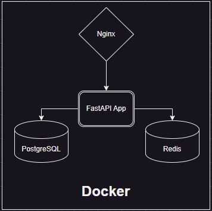

# SonneShop

SonneShop is a simple API for an abstract shop that provides the following features:

- Full set of authentication methods, including `login`, `refresh`, and `logout`.
- User account creation for payments (by default, a user can create no more than 3 accounts).
- Basic setup for integrating a payment system: currently, the payment router accepts user data and returns a placeholder link. In the future, it will generate a payment link with a specific payment system. The system confirms the payment by returning a signature, which the backend generates when requesting a payment.
- Role-based access control: two roles are currently implemented — `user` and `admin`.
  - **User** can place orders and manage their account.
  - **Admin** has access to:
    - Registering new products, setting prices, editing, and deleting products.
    - Managing the shop's virtual warehouse, including adding/removing products and checking stock levels.

The application is deployed in four Docker containers, managed by Docker Compose, and can be launched with a few simple commands. The project includes basic tests using pytest, as well as a configured CI/CD pipeline.

## Architecture



Nginx proxies requests to the API if they start with `/api`, while the backend operates with the databases. Currently, the following are used:
- **PostgreSQL** — for data storage.
- **Redis** — for caching requests and JWT tokens.

## Running Locally

1. Install Docker Compose 2.
2. Install Make utility.
3. Clone the repository:
    ```bash
    git clone https://github.com/SlenderV-Git/SonneShop
    ```
4. In the `backend-example` file, modify the variables with the required values (you can leave them as is for testing) and save it as `.env`:
    ```env
    POSTGRES_HOST='db-service'
    POSTGRES_PORT=5432
    POSTGRES_USER='username'
    POSTGRES_PASSWORD='password'
    POSTGRES_DB='db_name'

    REDIS_HOST='redis'
    REDIS_PORT=6379
    REDIS_PASSWORD='redis_password'
    REDIS_USER='redis_user'
    REDIS_USER_PASSWORD='redis_user_password'

    ELASTIC_HOST='elastic'
    ELASTIC_PORT=9200
    ELASTIC_PASSWORD='elastic_password'
    ELASTIC_LOG_INDEX='logs_index'

    DOC_TITLE='FastAPI'
    DOC_DESCRIPTION='App description'
    DOC_SUMMARY='App summary'
    ```
5. Generate private and public keys unique to your application. Depending on your operating system, use the following commands:

   **For Windows**:
    ```bash
    make create-certs-windows
    make create-signature-windows
    ```

   **For Linux/Unix**:
    ```bash
    make create-certs-unix
    make create-signature-unix
    ```

6. Set up the SSL certificate:
    1. Bind your server's IP to a domain (you can use free third-party domains, e.g., [DuckDNS](https://www.duckdns.org)).
    2. Install certbot on your system ([guide](https://certbot.eff.org/instructions)).
    3. Certbot will generate two keys: `fullchain.pem` and `privkey.pem`, which need to be copied to `./nginx/certs`.
    4. Update the server IP in the Nginx configuration file `.nginx/nginx.conf`:
        ```nginx
        events { }

        http {
            server {
                listen 443 ssl;
                server_name YOUR_IP_ADDRESS; # Change to your IP

                ssl_certificate /etc/nginx/certs/fullchain.pem;
                ssl_certificate_key /etc/nginx/certs/privkey.pem;

                location /api {
                    allow all;

                    proxy_pass http://backend-service:8080;
                    proxy_set_header Host $host;
                    proxy_set_header X-Real-IP $remote_addr;
                    proxy_set_header X-Forwarded-For $proxy_add_x_forwarded_for;
                    proxy_set_header X-Forwarded-Proto $scheme;
                }
            }
        }
        ```

7. Start the service:
    ```bash
    make up-all 
    ```
